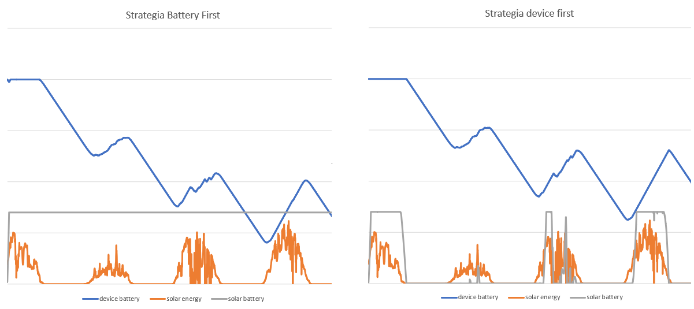

# About the project

This is a fork of the original [IoTSim repository](https://github.com/DNJha/IoTSim-Edge). The goal of our project was to extent the IoTSimEdge simulator to include irradiance data from the BSRN database and create a simple simulation of a device powered by a solar panel. This was part of a 2020/2021 winter semester IoT course at the Faculty of Computer Science, Electronics and Telecommunications of AGH University of Science and Technology, Kraków.

# Running the example

TODO

# Comparision of energy supply strategies

The following graphs show the energy stored both in th device battery and the solar panel battery with regards to the energy produced by the solar panel. The simulation is based on the example descirbed above. The length of the simulation is 4 days and, for better readability, the graph is not to scale.\

As we can see, in the case of the *BatteryFirst* strategy, the battery was charged to it's maximum capacity in the beginning of the simulation and never dropped afterwards. In case of the *DevicesFirst* strategy, the battery was only sometimes at it's full capacity, as the energy produced by the solar panel was diverted to the IoT deivce. In fact, the battery was mostly without any charge. However, the device's battery was better supplied and probably would have lasted longer before fully loosing all it's charge.

This poses an interesting question whever the first strategy is better because of it's longer solar panel battery lifespan. This small fork can answer many important questions based around supplying a group of IoT devices with energy - how many panels to use? Is higher solar panel efficiency better than a bigger solar panel area?

# Added Classes

## SolarPanel

Class representing a photovoltaic panel. It has all atributes needed to simulate a real life solar panel: efficiency and area. In addition, the panel stores a list of connected devices, which it supplies with energy, a battery, to which surplus energy is redirected, an energy transfer speed, a supply strategy, described below and a logger for simulation purposes.

Available methods:

*setPowerDistributionStrategy* - sets the panel's power supply energy.

*connect* - adds a device to the list of supplied devices.

*disconnect* - removes a device from the list of supplied devices

*supplyEnergy* - calculates the panel's energy output and directs it to it's connected devices, according to the supply strategy.

*getCurrentPowerOutput* - calculates the panel's energy output based on the solar irradiance, the temperature of the panel, it's efficiency and the angle between the solar panel and the solar rays. The formula used is based on the paper *Optimal Bidding Strategy for Microgrids Considering Renewable Energy and Building Thermal Dynamics* by Duong Tung Nguyen and Long Bao Le, 2014. Angle correction is based on [this website](https://www.ftexploring.com/solar-energy/sun-angle-and-insolation3.htm\).

*getCurrentBatteryCapacity* - returns the current battery capacity (how much more energy the battery is able to store).

## DataReader

The class responsible for the BSRN data reading from a *.tab* file. It has the following method:

*getData* - reads the data file and searchees for a row that corresponds with the given time and date. Returns data about solar irradiance at that time.

## PowerDistributionStrategy
A common interface for strategies of distributing the power produced by a solar pannel between its built-in battery and connected devices.

I includes one method, *distributePower*, which is tasked with completing all charging operations and returns nothing.

[//]: <> (Interfejs dla strategii dystrybucji energii wytworzonej przez panel słoneczny pomiędzy jego baterią a podłączonymi urządzeniami.)
[//]: <> (Posiada jedną metodę, *distributePower*, która wykonuje wszystkie operacje ładowania i niczego nie zwraca.)

## PowerDistributionVerboseStrategy
And abstract class describing a power distribution strategy using verbose console outputs.

Available methods:

*distributePower* - abstract method, which will implement strategy-specific power distribution logic.

*distributePowerToDevices* - evenly distributes power between a given list of devices. 
You can select if charging should use solar energy and the solar panel's battery, or just solar energy.
Prevents overcharging and recursively redistributes excess power between all connected devices.

*chargeSolarBattery*, *chargeDeviceFromSun*, *chargeDeviceFromBattery* - charges a single device or battery 
and outputs the charge amount as well as current battery capacity.

*announceLeftoverPower* - outputs the leftover power that was not used while charging.

[//]: <> (Abstrakcyjna klasa opisująca strategie dystrybucji mocy z wykorzystaniem szczegółowych wypisów do konsoli.)

[//]: <> (Dostępne metody:)

[//]: <> (*distributePower* - abstrakcyjna metoda, której zadaniem będzie wykonanie operacji ładowania zgodnie z wybraną strategią)

[//]: <> (*distributePowerToDevices* - rozdziela energię równo między listą urządzeń 
i pozwala wybrać, czy do ładowania użyć energii ze słońca czy słońca i baterii; 
unika przeładowania każdego z urządzeń, 
ogranicza szybkość przesyłu energii do wspólnej dla wszystkich urządzeń podanej wartości.)

[//]: <> (*chargeSolarBattery*, *chargeDeviceFromSun*, *chargeDeviceFromBattery* - ładują pojedyncze urządzenia, oraz wypisują wyniki do konsoli.)

[//]: <> (*announceLeftoverPower* - wypisanie informacji o ilości pozostałej energii.)

## PowerBatteryFirst
Power distribution strategy that prioritizes charging the solar battery. It will not use solar battery to power devices. Devices are only charged when battery is full or charging at the maximum speed.

[//]: <> (Strategia priorytetyzująca ładowanie baterii wbudowanej do panelu słonecznego. Dba o to, aby bateria zawsze była ładowana najszybciej jak się da, a pozostałą energię wykorzystuje do ładowania podłączonych urządzeń. Nie pozwala na ładowanie urządzeń z baterii panelu słonecznego.)

## PowerDevicesFirst
Power distribution strategy that prioritizes charging the device batteries. It will use battery power to charge device batteries if they are not charging at maximum speed. It will only charge the solar battery if each device is either fully charged or charging at the maximum rate.

[//]: <> (Strategia skupiona na ładowaniu baterii urządzeń. Gdy każde z urządzeń jest ładowane z maksymalną prędkością lub ma pełną baterię, przystępuje do łądowania baterii panelu. Gdy brak energii słonecznej, wykorzystuje baterię panelu do ładowania urządzeń. )

## Logger

Nonstatic logger class enabling reading and writing files.

## SolarExample

The class contains a simulation of an IoT device powered by a solar panel.\
